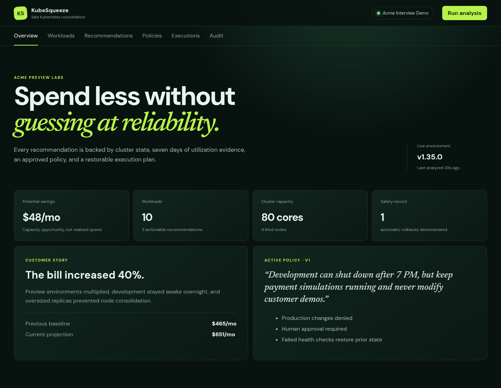
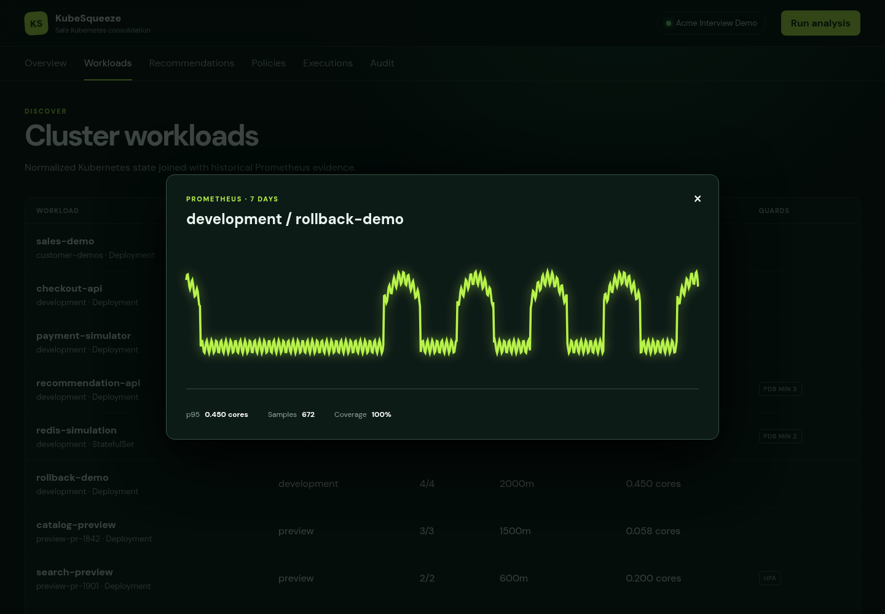
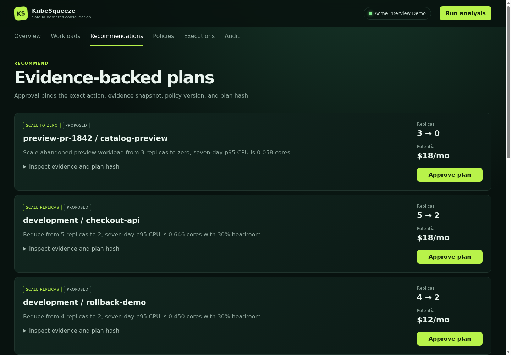
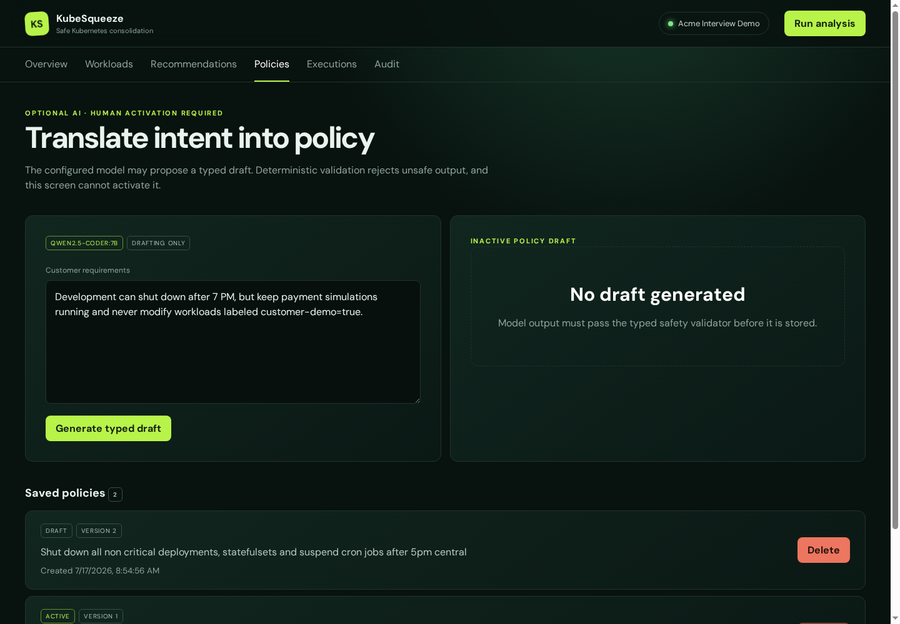
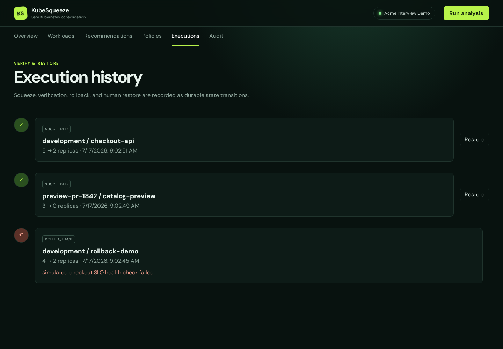
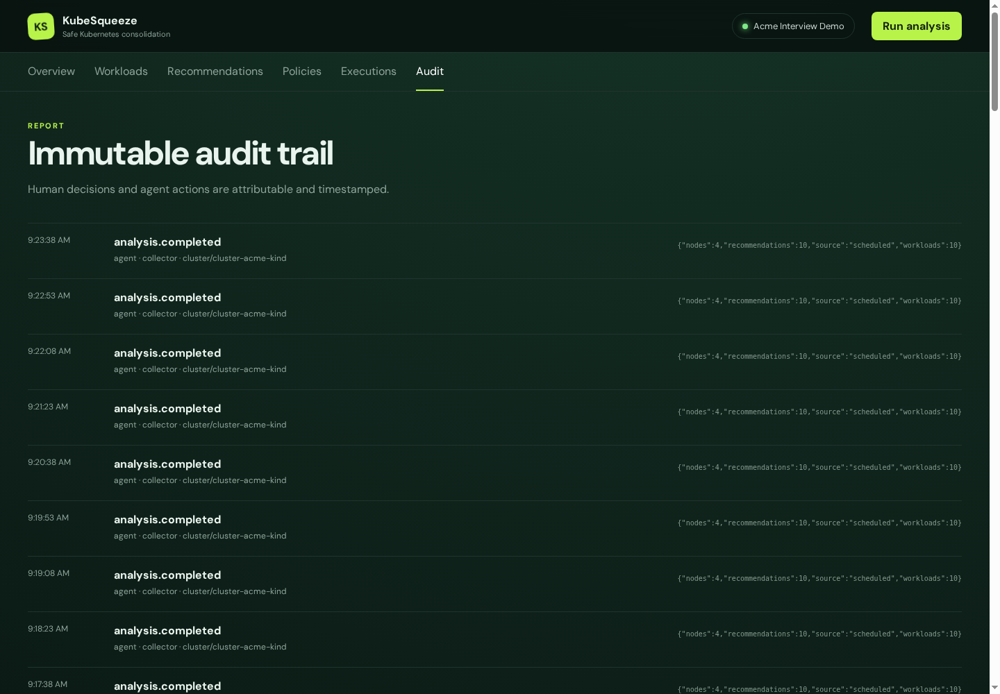

# KubeSqueeze Agent

KubeSqueeze is a runnable Kubernetes cost-optimization demo built around
deterministic discovery, planning, human approval, execution, verification,
and rollback.

## Dashboard tour

<a href="docs/assets/kubesqueeze-overview.png"></a>

<table>
  <tr>
    <td width="50%">
      <a href="docs/assets/kubesqueeze-workload-history.png"></a><br>
      <sub><strong>Historical evidence.</strong> Kubernetes state is joined with seven days of Prometheus utilization.</sub>
    </td>
    <td width="50%">
      <a href="docs/assets/kubesqueeze-recommendations.png"></a><br>
      <sub><strong>Deterministic plans.</strong> Every recommendation carries evidence, policy context, savings, and an approval gate.</sub>
    </td>
  </tr>
  <tr>
    <td width="50%">
      <a href="docs/assets/kubesqueeze-policies.png"></a><br>
      <sub><strong>Policy guardrails.</strong> An optional model can draft typed policy; deterministic validation and human activation remain mandatory.</sub>
    </td>
    <td width="50%">
      <a href="docs/assets/kubesqueeze-executions.png"></a><br>
      <sub><strong>Verify and restore.</strong> Scoped execution, health verification, automatic rollback, and manual restore are durable state transitions.</sub>
    </td>
  </tr>
  <tr>
    <td colspan="2">
      <a href="docs/assets/kubesqueeze-audit.png"></a><br>
      <sub><strong>Immutable audit trail.</strong> Human decisions and agent actions are attributable, timestamped, and streamed to the dashboard.</sub>
    </td>
  </tr>
</table>

## Run the complete stack

With Docker, Kind, kubectl, and curl installed:

```bash
make kind-up
```

Open <http://127.0.0.1:8080>. The command builds the application image and
deploys the React dashboard, Go server, read-only collector, scoped executor,
Postgres, Prometheus, seven days of seeded utilization history, and customer-
like workload fixtures into a four-node Kind cluster.

Use `make kind-down` to remove the cluster.

## Documentation

- [Development, debugging, fixtures, and commands](docs/development.md)
